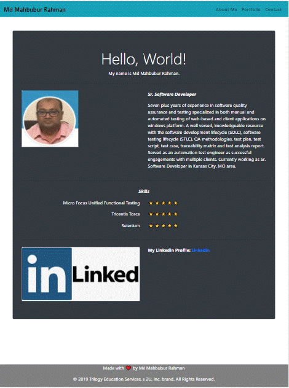
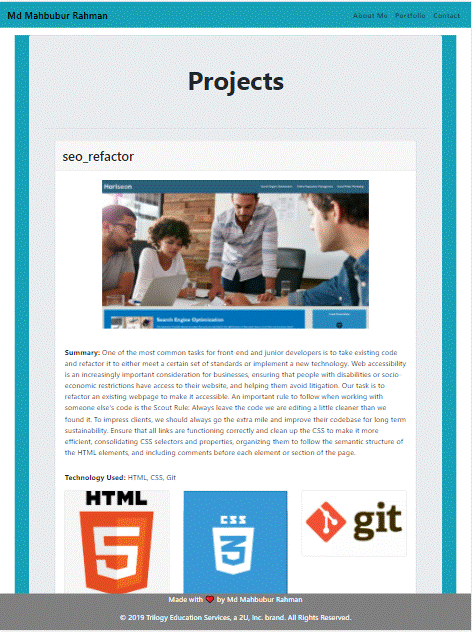
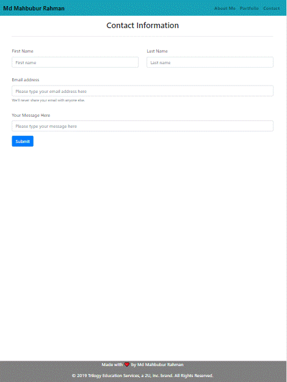

# 02_Responsive_Portfolio

## Link to deployed application

https://mahbub798.github.io/02_Responsive_Portfolio_MR/

## Description

Responsive design ensures that web applications render well on a variety of devices and window or screen sizes. As a developer, we will likely be asked to create a mobile-first application or add responsive design to an existing application. 

I used the Bootstrap CSS Framework to create a mobile responsive portfolio. I followed some guidelines:

* Created the following files files: `index.html`, `portfolio.html` and `contact.html`.

* Used Bootstrap, develop your portfolio site with the following items:

   * A navbar

   * A responsive layout

   * Responsive images

* The Bootstrap portfolio should minimize the use of media queries.git

* Used Bootstrap's grid system (containers, rows, and columns).

* On an `xs` screen, content should take up the entire screen. On `sm` and larger screens, I should have some margins on the left and right sides of the screen. Checked out various sites on my mobile device vs. my computer to see examples of these differences.

* Used an HTML validation service to ensure that each page has valid HTML.

## Mock-Up

The following image shows the web application's appearance and functionality:

